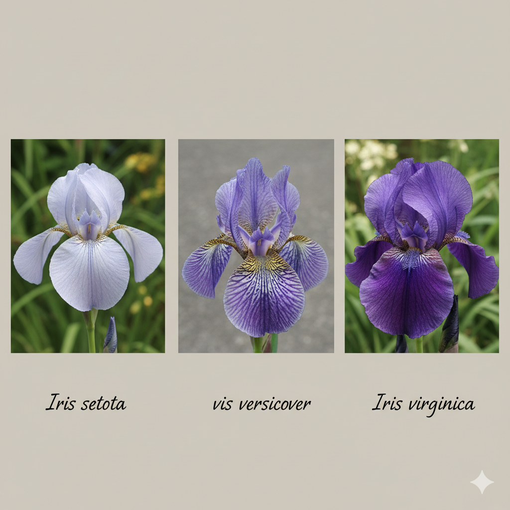
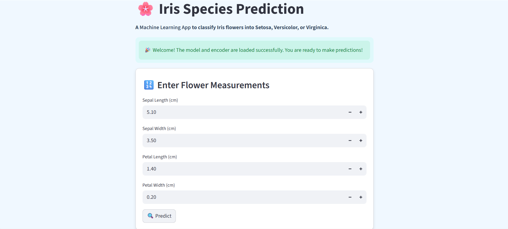

# 🌸 Iris Species Prediction

A Machine Learning project to classify **Iris flowers** into three species — **Setosa, Versicolor, Virginica** — based on their petal and sepal measurements.  
Built with **Scikit-Learn, Streamlit, Pandas, Matplotlib, Seaborn**.

---


---

## 📂 Project Structure
```bash
 Iris-Species-Prediction/
 ├── data/ # dataset (raw & processed)
 ├── notebooks/ # Jupyter notebooks (exploration → evaluation)
 ├── src/ # helper Python scripts
 ├── models/ # saved models & encoders
 ├── app/ # Streamlit app
 ├── README.md
 └── requirements.txt
 ```
---

## 📊 Workflow

 1. **Data Exploration** – Checked dataset structure (`df.info()`, `head()`, `describe()`).
 2. **Data Cleaning** – Handled missing values, ensured correct datatypes.
 3. **Exploratory Data Analysis (EDA)** – Visualized distributions and correlations using **Seaborn & Matplotlib**.
 4. **Model Training** – Trained multiple algorithms (SVC, RandomForest, Logistic Regression) and compared results.
 5. **Model Evaluation** – Selected **SVC** as best model (100% accuracy on test set, AUC = 1.0).
 6. **Deployment** – Built an interactive **Streamlit web app** for real-time predictions.

---

## 🚀 How to Run Locally:

### 1️⃣ Clone the repository:
 ```bash
 git clone https://github.com/thiruselvan-mle/Iris-Species-Prediction.git
 cd Iris-Species-Prediction
 ```

### 2️⃣ Create & activate environment:
 ```bash
 python -m venv venv
 # Windows
 venv\Scripts\activate
 # Linux/Mac   
 source venv/bin/activate  
 ```

### 3️⃣ Install dependencies:
 ```bash
 pip install -r requirements.txt
 ```

### 4️⃣ Run Jupyter Notebooks:
 ```bash
 jupyter notebook
     (OR)
 jupyter lab
 ```

### 5️⃣ Run the Streamlit App:
 ```bash
 streamlit run app/app.py
 ```

---


## 🌿 Example Prediction (via App)

- Input: Sepal length=5.1, Sepal width=3.5, Petal length=1.4, Petal width=0.2
- Output: Predicted Species → Setosa
- Confidence: Setosa: 98% | Versicolor: 1% | Virginica: 1%

---

## 🛠 Tech Stack
- Python 🐍
- Pandas & NumPy
- Matplotlib & Seaborn
- Scikit-Learn
- Streamlit

---

## 📌 Insights
- Setosa is linearly separable from other species.
- Petal length & width are the most important features for classification.
- SVC achieved 100% accuracy and perfect AUC across classes.
---

## 📷 Screenshots

 

---
## ✨ Future Improvements
- Add hyperparameter tuning for better generalization.
- Deploy app on Streamlit Cloud / Heroku / AWS.
- Enhance UI with flower images.
---

## 🤝 Contributing

 - Contributions are welcome! Please open an issue or submit a PR if you’d like to improve this project.
---

## 📜 License
   **This project is licensed under the MIT License**
